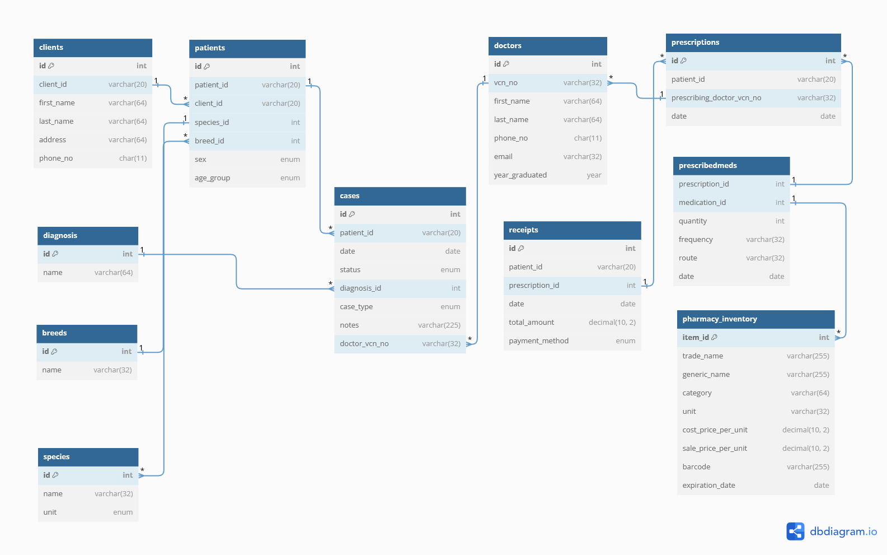

# Design Document

By Mukaddas Ahmad

## Scope

The database for Veterinary Clinic include the entities to facilitate keeping all essential records of clinical activities. As such, included in the database's scope is:

* Clients: Personal identifiable information of clients who visit the clinic.
* Doctors: Personal identifiable information of doctors registered with the veterinary council.
* Species: A list of all animal species presented to the clinic, classified into categories: Avian, Large Animal, Small Animal.
* Breeds: A list of all animal breeds presented to the clinic.
* Diagnosis: Common diagnoses encountered in the clinic.
* Patients: Demographics and information about the animal patients, including their client, species, breed, sex, and age group.
* Cases: Information about cases presented to the clinic, including diagnosis, case type, and notes.
* Pharmacy Inventory: Information about medications available in the clinic's pharmacy, including trade name, generic name, category, unit, and pricing.
* Prescriptions: Records of prescriptions given to patients, including the prescribing doctor and date.
* Prescribed Medications: A junction table to link prescriptions and medications, capturing quantity, frequency, route, and date.
* Receipts: Records of payments made by patients, including the total amount and payment method.

## Functional Requirements

This Database will support:

* CRUD operations for clients, doctors, species, breeds, diagnosis, patients, cases, pharmacy inventory, prescriptions, prescribed medications, and receipts
* Tracking all clients,patients,doctors and cases activities withing the clinic
* Adding multiple patients, cases and prescriptions to a client
* Adding multiple drugs to the pharmacy_inventory

## Representation

Entities are captured in MySQL tables with the following schema.

### Entities

The database includes the following entities:

#### Clients

The `clients` table includes:

* `id`,which specifies the unique internal ID for the client as an `INT`. This column thus has the `PRIMARY KEY` constraint applied.
* `client_id`, which specifies the unique external ID for the client as `VARCHAR(20)`.
* `first_name`, which specifies the client's first name as `VARCHAR(64)`.
* `last_name`, which specifies the client's last name as `VARCHAR(64)`.
* `address`,which specifies the client's address as `VARCHAR(64)`.
* `phone_no`,which specifies the client'S phone number as `CHAR(11)`.

#### Doctors

The `doctors` table includes:

* `id`,which specifies the unique internal ID for the doctor as an `INT`. This column thus has the `PRIMARY KEY` constraint applied.
* `vcn_no`,which specifies a Unique number (veterinary council number) to identify doctors issued by the veterinary licensing council .
* `first_name`, which specifies the doctor's first name as `VARCHAR(64)`.
* `last_name`, which specifies the doctor's last name as `VARCHAR(64)`.
* `phone_no`, which specifies the doctor's phone number as `CHAR(11)`.
* `email`, which specifies the doctor's email as `VARCHAR(32)`.
* `year_graduated`, which specifies the doctor's year of graduation `YEAR`.

#### Species

The `species` table includes:

* `id`, which specifies the unique internal ID for a species as an `INT`. This column thus has the `PRIMARY KEY` constraint applied.
* `name`, which specifies the name of the species as `VARCHAR(32)`. This column has the UNIQUE constraint applied to avoid repition.
* `unit`, which specifies the category based on three groups namely Small Animal, Large Animal and Avian as `ENUM`.

#### Breeds

The `breeds` table includes:

* `id`, which specifies the unique internal ID for a breed as an `INT`. This column thus has the `PRIMARY KEY` constraint applied.
* `name`, which specifies the name of the breed as `VARCHAR(32)`. This column has the UNIQUE and constraint applied to avoid repition.

### Diagnosis

The `diagnosis` table includes:

* `id`, which specifies the unique internal ID for a diagnosis as an `INT`. This column thus has the `PRIMARY KEY` constraint applied.
* `name`, which specifies the name of the diagnosis as `VARCHAR(64)`. This column has the UNIQUE constraint applied to avoid repition.

### Patients

The `patients` table includes:

* `id`, which specifies the unique internal ID for a patients as an `INT`. This column thus has the `PRIMARY KEY` constraint applied.
*  `patient_id`, which specifies the unique external ID for the patient as `VARCHAR(20)`.
* `client_id`, which is the ID  of the client who presented the patient as a `VARCHAR(20)`.This column thus has the `FOREIGN KEY` constraint applied, referencing the `client_id` column in the `clients` table to ensure data integrity.
*  `species_id`, which is the species of the patient presented as an `INT`.This column thus has the `FOREIGN KEY` constraint applied, referencing the `id` column in the `species` table to ensure data integrity.
* `breed_id`, which is the breed of the patient presented as an `INT`.This column thus has the `FOREIGN KEY` constraint applied, referencing the `id` column in the `breeds` table to ensure data integrity.
* `sex`,which specifies the sex of the patient as male or female represented as `ENUM`.
* `age_group`,which specifies the age group of the patient as young or adult represented as `ENUM`.

### Cases

The `cases` table includes:

* `id`, which specifies the unique ID for cases managed in the clinic as an `INT`.This column thus has the `PRIMARY KEY` constraint applied.
* `patient_id`, which is the ID  of the patient as a `VARCHAR(20)`.This column thus has the `FOREIGN KEY` constraint applied, referencing the `patient_id` column in the `patients` table to ensure data integrity.
* `date`, which specifies the date the case was managed as `DATE`.
* `status`, which specifies if the case is a new case or and updated case presented as `ENUM`.
* `diagnosis_id`, which specifies the diagnosis as an `INT`.This column thus has the `FOREIGN KEY` constraint applied, referencing the `id` column in the `diagnosis` table to ensure data integrity.
* `case_type`, which specifies how the case was managed as either medical or surgical represented as `ENUM`.
* `notes`, which specifies additional notes by the doctor as `VARCHAR(255)`.
* `doctor_vcn_no`, which specifies the vcn_no of the doctor that managed the case as `VARCHAR(32)`.This column thus has the `FOREIGN KEY` constraint applied, referencing the `vcn_no` column in the `doctors` table to ensure data integrity.

# Pharmacy_inventory

The `pharmacy_inventory` table includes:

* `item_id`, which specifies the unique ID for items in the inventory as an `INT`.This column thus has the `PRIMARY KEY` constraint applied.
* `trade_name`, which specifies the trade name of the item as `VARCHAR(255)`.
* `generic_name`, which specifies the generic name of the item as `VARCHAR(255)`.
* `category`, which specifies the category of the item as `VARCHAR(64)`.
* `unit`, which specifies the unit of the item as `VARCHAR(32)`.
* `cost_price_per_unit`, which specifies the cost per the above unit of the item as `DECIMAL`.
* `sale_price_per_unit`, which specifies the sale per the above unit of the item as `DECIMAL`.
* `barcode`, which specifies the barcode of the item as `VARCHAR(255)`.
* `expiration_date`, which specifies the expiry date of the item as `DATE`.

# Prescriptions

The `prescriptions` table includes:

* `id`, which specifies the unique ID for a prescription in the clinic as an `INT`.This column thus has the `PRIMARY KEY` constraint applied.
* `patient_id`, which is the ID  of the patient linked to the prescription as `VARCHAR(20)`.This column thus has the `FOREIGN KEY` constraint applied, referencing the `patient_id` column in the `patients` table to ensure data integrity.
* `prescribing_doctor_vcn_no`, which specifies the vcn_no of the doctor that made the prescription `VARCHAR(32)`.This column thus has the `FOREIGN KEY` constraint applied, referencing the `vcn_no` column in the `doctors` table to ensure data integrity.
* `date`, which specifies the date the prescription was made as `DATE`.

# Prescribedmeds

The `prescribedmeds` table includes:

* `id`, which specifies the unique ID for a medication in the clinic as an `INT`.This column thus has the `PRIMARY KEY` constraint applied.
* `prescription_id`, which specifies the prescription_id being referenced as `INT`. This column thus has the `FOREIGN KEY` constraint applied, referencing the `id` column in the `prescriptions` table to ensure data integrity.
* `medication_id`, which specifies the item being prescribed as `INT`. This column thus has the `FOREIGN KEY` constraint applied, referencing the `item_id` column in the `pharmacy_inventory` table to ensure data integrity.
* `quantity`, which specifies the quantity of item being prescribed as `INT`.
* `frequency`, which specifies how often the item be used or administered as `VARCHAR(32)`.
* `route`, which specifes the route of administration as `VARCHAR(32)`.
* `date`, which specifies the date of prescription as `DATE`.

# Reciepts

The `receipts` table includes:

* `id`, which specifies the unique ID for a reciepts issued in the clinic as an `INT`.This column thus has the `PRIMARY KEY` constraint applied.
* `patient_id`, which is the ID  of the patient who was issued the receipt as  `VARCHAR(20)`.This column thus has the `FOREIGN KEY` constraint applied, referencing the `patient_id` column in the `patients` table to ensure data integrity.
* `prescription_id`, which specifies the prescription_id being referenced as `INT`. This column thus has the `FOREIGN KEY` constraint applied, referencing the `id` column in the `prescriptions` table to ensure data integrity.
* `date`, which specifies the date which the receipt was issued as `DATE`.
* `total_amount`, which specifies the total amount in the reciept as `DECIMAL`.
* `payment_method`, which specifies the method of payment as either cash or card represented as `ENUM`.

### Relationships

The below entity relationship diagram describes the relationships among the entities in the database.

As detailed in the diagram:

* One client is capable of having one to many patients. They present a single patient or several multiple patients. As also one client can have one to many cases. But each case or patient is only owned by one client.
* One patient can only have a one species and one breed but one breed and one species can represent several patients.
* One doctor can manage zero to several cases, however each case is managed by one doctor.
* Each case can only have one diagnosis,but one diagnosis can be represented in several cases.
* One doctor can write several prescriptions but one prescription is written by only one doctor.
* A prescription can have one to many medications in the prescribedmeds table but one medication can only be from one prescription.

## Optimizations

Per the typical queries in `queries.sql`, it is common for users of the database to find clients,patients, case, drug and prescription by id. For that reason, indexes are created on the `id` columns to speed the identification. Other indexes have been created for regular search as denoted by the `schema.sql`.

## Limitations

The current schema does not take into account scheduling for the clinic. if this is required, additional tables would need to be created.

